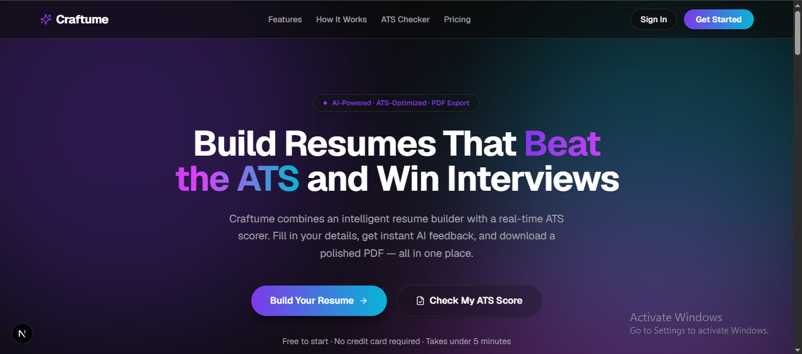

**<div align="center">

# Craftume

**AI-powered resume builder with real-time ATS scoring**

Build a polished, ATS-optimized resume with a live split-screen editor, then get instant AI feedback on exactly what to fix before you hit send.

<!-- 📸 Replace the path below with your actual screenshot -->


[](https://nextjs.org/)
[](https://react.dev/)
[](https://www.typescriptlang.org/)
[](https://supabase.com/)
[](https://tailwindcss.com/)
[](#license)

</div>

---

## About the Project

Most job seekers use two disconnected tools to apply for a job: one to build a resume, another to check if it'll actually survive an ATS (Applicant Tracking System) scan. **Craftume merges both into a single workflow.**

- Build your resume in a **live split-screen editor** — form on the left, real-time preview on the right.
- Paste a job description and get an **AI-generated ATS compatibility score** with section-by-section feedback.
- Export a clean, **real selectable-text PDF** — not a screenshot — so it renders correctly for both humans and ATS parsers.

This is a solo-built, production-oriented SaaS project — architected, designed, and iterated end-to-end as a real product, not a tutorial clone.

---

## ✨ Features

### Currently Live
- 🎨 Dark "Aurora Glassmorphism" landing page with animated background and motion-based UI
- 🔐 Full authentication — email/password + Google OAuth via Supabase Auth
- 🛡️ Protected dashboard shell with session-aware routing and middleware guards
- 🧩 Centralized design token system (single source of truth for all colors, spacing, radii)

### In Progress / Roadmap
- 📝 Split-screen resume builder with dynamic, reorderable sections
- 📄 Clean PDF export via `@react-pdf/renderer` (real text, not a rasterized image)
- 🤖 AI-powered ATS Checker — upload a resume + job title, get a score and actionable suggestions
- 📊 Hybrid ATS scoring engine — rule-based checks (formatting, keywords) + AI analysis, combined
- 💾 Multiple saved resumes per user with version history
- ✍️ AI writing assistance — summary generation, bullet-point rewriting, keyword suggestions

---

## 🛠️ Tech Stack

| Layer | Technology |
|---|---|
| **Framework** | Next.js 16 (App Router), React 19 |
| **Language** | TypeScript |
| **Styling** | Tailwind CSS, custom design-token system (`theme.css`) |
| **Animation** | Framer Motion |
| **State Management** | Redux Toolkit |
| **Forms & Validation** | React Hook Form + Zod |
| **Backend / Auth / DB** | Supabase (PostgreSQL, Auth, Storage, Row Level Security) |
| **AI** | Google Gemini API |
| **PDF Generation** | `@react-pdf/renderer` (real, selectable-text PDFs) |
| **UI Primitives** | Radix UI (shadcn-style components) |
| **Icons** | Lucide React |

---

## 📁 Project Structure

```
craftume/
├── proxy.ts                  # Next.js middleware — auth session refresh & route guarding
├── src/
│   ├── app/                  # Next.js App Router routes
│   │   ├── auth/             # Login, sign-up, password reset, OAuth callback
│   │   └── protected/        # Authenticated dashboard routes
│   ├── components/           # Shared UI primitives & layout components
│   ├── features/             # Feature-scoped modules (auth, resume, ats, dashboard, ...)
│   ├── redux/                # Store, hooks, and slices
│   ├── ai/                   # AI provider abstraction, prompts, services
│   ├── lib/                  # Supabase clients, utilities
│   ├── config/                # App-wide constants and configuration
│   └── styles/                # theme.css — single source of truth for design tokens
└── ...
```

---

## 🗺️ Roadmap

- [x] Project foundation & design token system
- [x] Landing page (Dark Aurora Glassmorphism)
- [x] Authentication (email/password + Google OAuth)
- [x] Dashboard shell
- [ ] Resume builder — dynamic sections & live preview
- [ ] PDF export
- [ ] AI ATS Checker
- [ ] Resume management (save, duplicate, delete, version history)
- [ ] AI writing assistant features
- [ ] Deployment

---

## 👤 Author

**Pardeep Sharma**
Building Craftume as a solo developer project.

</div>**
